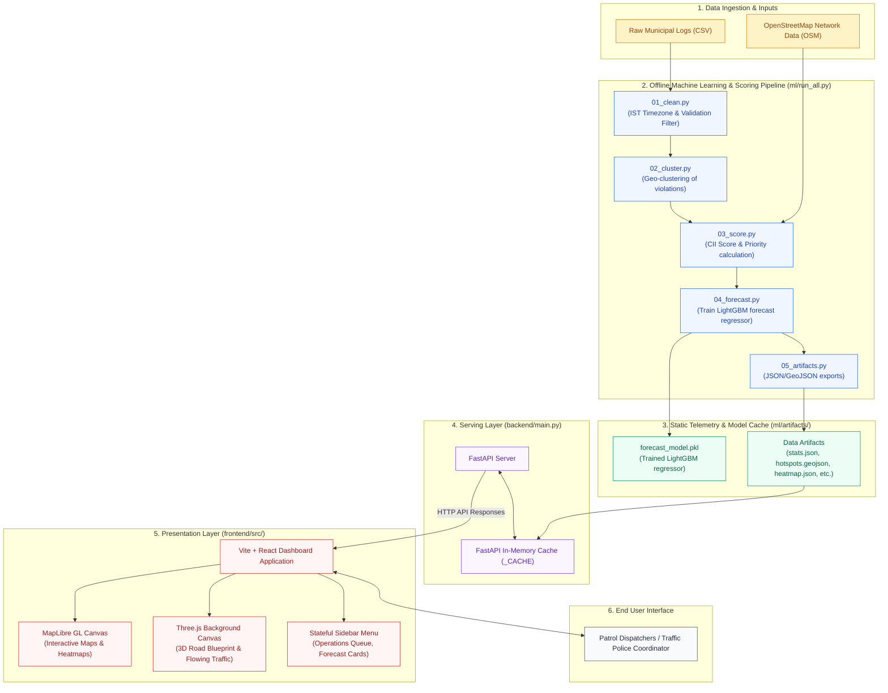

# NammaFLOW System Architecture

This document describes the high-level architecture, pipeline flow, and data serving layers of the NammaFLOW traffic enforcement intelligence platform.

---

## Architecture Flow Overview

---

## 1. Data Ingestion & Inputs
* **Raw Municipal Logs**: Historical geo-logged parking and traffic violation records containing timestamps, locations, and category attributes.
* **OpenStreetMap (OSM)**: Extracted street segment layouts, lane numbers, bus stops, and localized traffic restrictions. Used by `osm_helper.py` to calculate lane constraints and bottleneck points.

## 2. Preprocessing & ML Pipeline (`ml/`)
The pipeline runs sequentially via `ml/run_all.py` to compute and clean the modeling data:
* **`01_clean.py`**: Converts raw UTC coordinates and timestamps into Asia/Kolkata (IST), cleans invalid fields, and filters for approved, core validation records.
* **`02_cluster.py`**: Groups scattered violation coordinates into distinct spatial hotspot clusters.
* **`03_score.py`**: Calculates the **Congestion Impact Index (CII)** using lane layouts, vehicle footprint severity factors, and persistence rates over time. Also normalizes values based on historical officer patrol coverage to eliminate presence bias.
* **`04_forecast.py`**: Builds weekly (168-hour) forecasts using a trained **LightGBM** regressor, exportable to a cached serialization file (`forecast_model.pkl`).
* **`05_artifacts.py`**: Generates and formats JSON and GeoJSON structures representing priority leaderboards, heatmaps, and dark zones.

## 3. Serving Layer (`backend/`)
* Built using the **FastAPI** ASGI framework in Python.
* Loads all data artifacts into an in-memory cache (`_CACHE`) at server startup.
* Serves static JSON data at endpoints like `/api/stats`, `/api/hotspots`, `/api/priority-queue`, `/api/forecast`, `/api/dark-zones`, and `/api/temporal`.

## 4. Presentation Layer (`frontend/`)
* Built with **Vite, React, and Tailwind CSS**.
* **MapLibre GL**: Visualizes city heatmaps, interactive hotspot markers, and predicted grid cells client-side.
* **Three.js**: Powers the landing page background canvas, rendering smooth, faded 3D road blueprints and glowing vector traffic flows.
* **Stateful Sidebar Menu**: Displays dispatch operations lists, predictive forecast cards, and coverage gaps. Can be collapsed for a full-screen map experience.
