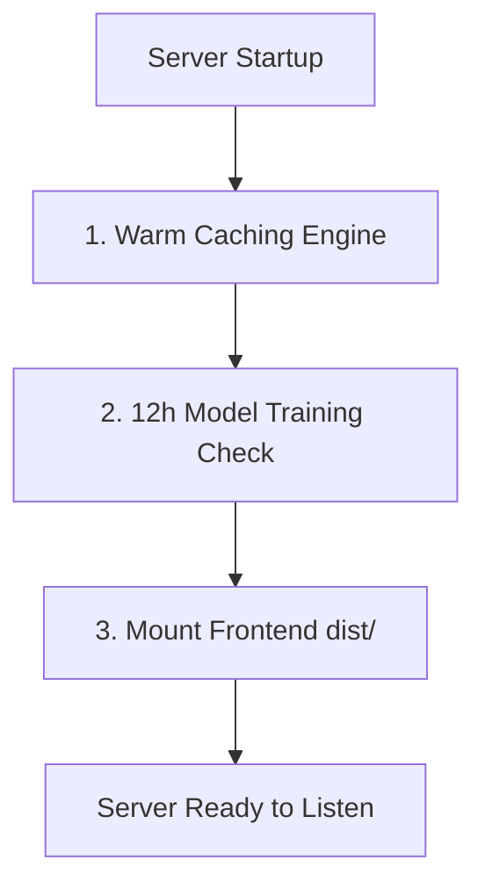

# NammaFLOW Serving Backend

This directory houses the FastAPI serving application for NammaFLOW. During local development, the backend serves JSON/GeoJSON database files, provides endpoints for spatial queries, and handles model training/inference tasks.

---

## 1. System Architecture and Boot Workflows

FastAPI is configured as an asynchronous serving engine:



### Stage 1: Warm Caching Engine
On boot, the server loads all spatial artifacts from the filesystem into an in-memory dictionary `_CACHE`. This ensures subsequent GET queries retrieve static GeoJSON features in microseconds:
```python
_CACHE: dict = {}
def _load(name: str):
    if name not in _CACHE:
        path = ARTIFACTS / name
        _CACHE[name] = json.loads(path.read_text())
    return _CACHE[name]
```

### Stage 2: Startup Model Training Check
The backend monitors the existence of `forecast_model_12h.pkl` in the artifacts folder. If the trained operational model is missing, it dynamically appends `ml` to Python's system path, parses the default raw violations dataset, fits the blended ensemble model, and serializes the state to disk.

### Stage 3: Static Mounting
Checks for the presence of the built static React client under `frontend/dist/`. If found, it mounts the static folder to the root endpoint (`/`) to host the entire command console on a single port.

---

## 2. API Endpoint Specification

The serving API exposes the following endpoints (default port `8000`):

| Method | Endpoint | Description | Request Parameters | Response Format |
|---|---|---|---|---|
| **GET** | `/api/health` | Returns server operational status and available JSON artifacts. | None | `{"status": "ok", "artifacts": [...]}` |
| **GET** | `/api/stats` | Aggregated citywide metrics (total violations, worst hotspots). | None | `{"total_violations": 20456, ...}` |
| **GET** | `/api/hotspots` | GeoJSON FeatureCollection of all prioritized parking hotspots. | None | `{"type": "FeatureCollection", ...}` |
| **GET** | `/api/hotspot/{id}` | Detailed properties and temporal histograms for a single hotspot. | `id` (Path, int) | GeoJSON Feature |
| **GET** | `/api/heatmap` | Fine-grained Geohash-7 violation density grid coordinates. | None | JSON Array |
| **GET** | `/api/priority-queue` | Priority queue list sorted worst-first based on impact score. | `limit` (Query, int) | JSON Array |
| **GET** | `/api/forecast` | Weekly 168-hour spatiotemporal forecast predictions. | None | JSON Object |
| **GET** | `/api/temporal` | Weekly load matrices and peak hourly windows. | None | JSON Object |
| **GET** | `/api/dark-zones` | High-risk transit exit regions lacking recorded patrols. | None | JSON Array |
| **GET** | `/api/forecast-12h` | Next-shift forecast predictions and confidence intervals. | None | `{"total_12h": 269.1, ...}` |
| **POST** | `/api/forecast-12h/upload` | Recieves raw e-challan CSV to retrain operational model. | Multipart File | `501 NotImplemented` (static build restriction) |

---

## 3. Local Setup and Deployment

1. **Activate Environment**:
   ```bash
   .venv\Scripts\activate
   ```
2. **Launch Server**:
   ```bash
   uvicorn backend.main:app --reload --port 8000
   ```
3. **Interactive Documentation**:
   - OpenAPI Swagger interface: http://localhost:8000/docs
   - Alternative Redoc interface: http://localhost:8000/redoc
