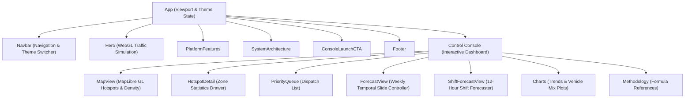

# NammaFLOW Frontend Dashboard

This directory contains the React application for the NammaFLOW command center console. The dashboard loads precomputed spatiotemporal database artifacts to render interactive GIS maps, priority dispatch queues, weekly congestion matrices, and operational forecasts.

---

## Component Hierarchy

The dashboard component hierarchy is organized as follows:



---

## Technical Architecture

* **State Management**: The core data is fetched once at boot inside `App.jsx` and distributed to widgets via React props. Tab routing and map selection markers are kept in React component states to keep loading times fast.
* **Map Rendering**: Built around MapLibre GL, utilizing Vector maps. Hotspots are plotted as coordinate vectors, and density is plotted using client-side GeoHash-7 boundary calculations.
* **Canvas Particles**: The Hero canvas runs custom WebGL shaders through Three.js to render animated waves of traffic particles.
* **Theme Styling**: Uses vanilla CSS custom properties (variables) declared in `index.css` to enable smooth light and dark mode switching.

---

## Static Ingestion Layer

The application queries data from [api.js](file:///c:/Users/SSN/OneDrive%20-%20Shiv%20Nadar%20University%20-%20Chennai/Desktop/parksight_v3/parksight/frontend/src/lib/api.js). To allow deployment as a pure static site without a live Python backend, all queries retrieve static files directly from `public/data/`:

* **Stats**: `/data/stats.json`
* **Hotspots**: `/data/hotspots.geojson`
* **Heatmap Grid**: `/data/heatmap.json`
* **Priority Queue**: `/data/priority_queue.json`
* **Weekly Forecast**: `/data/forecast.json`
* **Temporal Matrix**: `/data/temporal.json`
* **Methodology**: `/data/methodology.json`
* **Unenforced Gaps**: `/data/dark_zones.json`
* **12-Hour Forecast**: `/data/forecast_12h.json`

---

## Development Setup

1. **Install Dependencies**:
   ```bash
   npm install
   ```
2. **Launch Dev Server**:
   ```bash
   npm run dev
   ```
   *This starts the Vite local server on http://localhost:5173.*
3. **Compile Production Bundle**:
   ```bash
   npm run build
   ```
   *Compiles minified assets to the `/dist` directory for static serving.*
