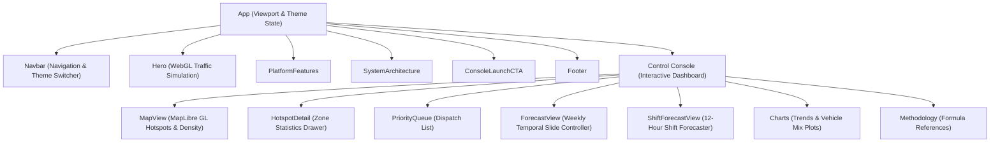

# NammaFLOW Frontend Dashboard

This directory houses the React application for the NammaFLOW command center console. The dashboard uses precomputed spatiotemporal data artifacts to render interactive GIS maps, priority dispatch queues, weekly congestion matrices, and operational forecasts.

---

## 1. Component Hierarchy

The viewport and layout controllers are organized hierarchically:



---

## 2. Technical Architecture and State Flow

The client operates on a centralized data ingestion pattern:
* **Single Ingestion Point**: Core data is fetched once at boot inside `App.jsx` using `getAll()` from `lib/api.js`. If static artifacts are missing or unreadable, the console displays a offline/caching state warning.
* **Reactive Dispatch System**: The app tracks local officer allocations in a reactive state array (`dispatchedCops`), letting users dispatch patrols to hotspot nodes. Dispatch counts are visually represented on the GIS map.
* **Smooth Scrolling**: Lenis is initialized inside the landing layout for smooth scrolling transitions between overview sections.

### Key React View States
* `theme`: `light` or `dark` (toggles class `.dark` on the root document element).
* `view`: `landing` or `console` (toggles between client homepage and dispatch dashboard).
* `activeTab`: `dispatch` (priority list), `forecast` (weekly predictions slider), `darkzones` (unpatrolled POIs), `analytics` (trend charts), or `methodology` (math descriptions).
* `selectedId`: The integer ID of the currently selected spatial hotspot.

---

## 3. Spatial Map Layers (MapView)

Map rendering is wrapped in MapLibre GL, loading open vector base maps. 

### Hotspots Vector Layer
Plots coordinate vectors from `hotspots.geojson` as circular nodes. Radius and colors scale based on calculated priority score:
$$\text{Radius} = \text{Interpolate}(\text{Score}, 40 \to 6\text{px}, 100 \to 20\text{px})$$
$$\text{Color} = \begin{cases} 
      \text{\#e11d48 (Critical)} & \text{if Score} \ge 90 \\
      \text{\#f43f5e (High)} & \text{if } 80 \le \text{Score} < 90 \\
      \text{\#fbbf24 (Medium)} & \text{if } 60 \le \text{Score} < 80 \\
      \text{\#06b6d4 (Low)} & \text{if Score} < 60
   \end{cases}$$

### Spillover Congestion Ripple Layer
When a hotspot is selected, the client filters surrounding Geohash-7 cells from `heatmap.json` within a $500\text{m}$ radius. It renders concentric shaded rings to illustrate local bottleneck spillover:
* **Inner Ring**: Cells $\le 250\text{m}$ (red glow, $0.70$ opacity scale).
* **Outer Ring**: Cells $250\text{m} < d \le 500\text{m}$ (orange glow, $0.45$ opacity scale).

### Predictive Heatmap Layer
When in forecast mode, the map reads Geohash-6 grids from `forecast.json` and renders a dynamic density heatmap representing predicted hourly tickets. Users can slide a timeline to query any of the 168 hours in a week.

---

## 4. WebGL Traffic Simulation (ThreeTrafficBg)

The landing backdrop runs a custom WebGL shader program using Three.js:
* **Road Topology**: Generated using Catmull-Rom splines representing major routes, loops, and diagonal corridors across Bengaluru.
* **Asphalt ribbons**: Ribbon meshes are built by calculating normal vectors perpendicular to the road tangents.
* **Traffic Particles**: Flows 36 vehicle headlights (spherical meshes) along the spline curves. Particle positions are updated frame-by-frame based on randomized speed parameters.
* **Bobbing Hotspot Pins**: Renders conical indicators representing parking hotspots, utilizing basic material properties and sine-wave calculations to bob pins and expand warning circles:
  $$Y_{\text{pin}} = Y_{\text{base}} + \sin(t \times v_{\text{bob}} + \phi_{\text{offset}}) \times 0.5$$

---

## 5. Development and Build Settings

Vite compiles the source files into static assets.

1. **Install Dependencies**:
   ```bash
   npm install
   ```
2. **Start Dev Server**:
   ```bash
   npm run dev
   ```
   *Launches local server at http://localhost:5173.*
3. **Compile Production Build**:
   ```bash
   npm run build
   ```
   *Outputs optimized bundle under `/dist` (HTML, CSS variables, and minified JS).*
