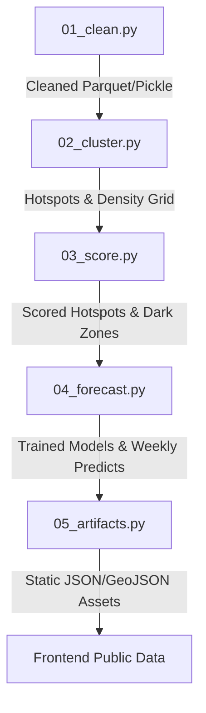

# NammaFLOW ML and Ingestion Pipeline

This directory houses the data cleaning, spatial clustering, multi-dimensional scoring, forecasting, and artifact serialization modules. The pipeline processes raw e-challan traffic violation records to extract spatial patterns, correct for enforcement-bias, and predict future violation loads.

---

## 1. Ingestion Pipeline Stages

The end-to-end data pipeline is orchestrated by [run_all.py](file:///c:/Users/SSN/OneDrive%20-%20Shiv%20Nadar%20University%20-%20Chennai/Desktop/parksight_v3/parksight/ml/run_all.py), executing five Python modules in sequence:



### Stage 01: Data Ingestion and Sanitization (01_clean.py)
* **Timezone Localization**: Raw timestamps are parsed as UTC, converted to Asia/Kolkata timezone (IST), and stripped of timezone info to preserve naive wall-clock time:
  $$\text{IST} = \text{UTC} + 5\text{h } 30\text{m}$$
* **Spatial Bounds Filtering**: Records outside the latitude ($12.70 \le \phi \le 13.40$) and longitude ($77.35 \le \lambda \le 77.85$) boundaries of Bengaluru are dropped.
* **Validation Filtering**: Isolates records with `validation_status == 'approved'` to establish a validated data core.
* **Geohashing**: Computes coarse Geohash-6 (approx. 1.2km) for forecasting aggregation and fine Geohash-7 (approx. 150m) for high-definition density mapping.

### Stage 02: Spatial Hotspot Clustering (02_cluster.py)
* **Coordinate Projection**: Projects spherical coordinates to local meters relative to Bengaluru boundaries:
  $$x = (\lambda - \lambda_{\text{min}}) \times 108,000.0$$
  $$y = (\phi - \phi_{\text{min}}) \times 110,574.0$$
* **Density-Based Clustering**: Runs scikit-learn's native HDBSCAN to group coordinate locations into discrete hotspots:
  $$\text{Min Cluster Size} = \max\left(50, \lfloor N_{\text{samples}} \times 0.0008 \rfloor\right)$$
  $$\text{Min Samples} = 15$$
  *Falls back to DBSCAN with $\text{eps} = 55.0$ and $\text{min\_samples} = 40$ if HDBSCAN is unavailable.*

### Stage 03: Proximity Scoring and Gap Analysis (03_score.py)
* **Enrichment**: Queries Metro exits and hospitals from OpenStreetMap (using Overpass API with local fallback) and computes distance using the Haversine formula:
  $$d = 2 R \arcsin\left(\sqrt{\sin^2\left(\frac{\Delta \phi}{2}\right) + \cos(\phi_1)\cos(\phi_2)\sin^2\left(\frac{\Delta \lambda}{2}\right)}\right)$$
* **Road Lane Classification**: Determines lane count based on text indicators:
  * Highway / Ring Road / Expressway: 3 lanes
  * Main / Road / Junction / Flyover: 2 lanes
  * Other: 1 lane
* **Enforcement-Bias Correction**: Normalizes raw hotspot counts ($C_c$) by the number of unique officers ($O_c$) to correct for police presence:
  $$A_c = \frac{C_c}{\sqrt{O_c}}$$
* **Congestion Impact Index (CII)**: Combines density, vehicle severity, lane limitations, and landmark proximity.
* **Economic Loss Model**: Converts physical congestion metrics into monetary hourly drag.
* **Dark-Zone Scan**: Finds hospitals or transit exits with zero e-challan violations within a 400m radius.

### Stage 04: Spatiotemporal Forecasting (04_forecast.py)
* **Panel Assembly**: Aggregates historic hourly counts over Geohash-6 cells to compile 168-hour weekly profiles.
* **Ensemble Forecast Model**: Fits a blended regression model to forecast weekly patterns using time-of-day, day-of-week, weekend flags, and geohash density indexes.
* **Model Serialization**: Fits final regressors and dumps trained structures to `forecast_model.pkl`.

### Stage 05: Artifact Serialization (05_artifacts.py)
* Compiles scored hotspots, density coordinates, matrices, and parameters.
* Writes compressed static JSON and GeoJSON outputs, saving them directly into `frontend/public/data/`.

---

## 2. Mathematical Methodology and Formulations

NammaFLOW uses multi-dimensional spatial calculations to prioritize enforcement locations.

### Enforcement-Bias Correction
Raw ticket counts are naturally biased toward areas where traffic police officers are permanently stationed. To isolate genuine parking violations, NammaFLOW normalizes hotspot density counts:
$$A_c = \frac{C_c}{\sqrt{O_c}}$$
* $A_c$: Adjusted violation density count.
* $C_c$: Raw ticket count in cluster $c$.
* $O_c$: Distinct officer IDs (or reporting device IDs) that registered tickets within cluster $c$.
* *Rationale*: The square root scaling penalizes areas with heavy patrol presence without over-correcting low-patrol zones where single officers report critical violations.

### Shannon Entropy of Temporal Persistence
To differentiate chronic parking issues from transient events, the pipeline computes the normalized Shannon entropy of a hotspot's hourly histogram:

$$H_s = -\frac{1}{\ln(24)} \sum_{i=0}^{23} p_i \ln(p_i)$$

* $p_i$: Proportion of tickets occurring in hour $i$, defined as $p_i = \frac{count_i}{\sum count_i}$ (where $p_i > 0$).
* *Interpretation*: A value of $H_s \approx 1$ represents constant all-day congestion, while $H_s \approx 0$ indicates a tight, brief congestion window.
* *Composite Persistence ($P$)*:

  $$P = 0.6 \times \text{Norm}(\text{Days Active}) + 0.4 \times H_s$$

### Proximity Factor ($P_{\text{prox}}$)
Hotspots blocking critical municipal infrastructure are weighted heavier:

$$P_{\text{prox}} = \begin{cases} 
      2.0 & \text{if emergency hospital exit dist} \le 200\text{m} \\
      1.5 & \text{if metro transit exit dist} \le 200\text{m} \\
      1.3 & \text{if hospital or metro dist} \le 500\text{m} \\
      1.0 & \text{otherwise}
   \end{cases}$$

### Congestion Impact Index (CII)
The raw physical impact index is calculated by multiplying vehicle size footprint, street lane constraints, adjusted spatial density, persistence, and landmark proximity:

$$\text{CII}_{\text{raw}} = V_f \times L_{\text{road}} \times D_{\text{adj}} \times P \times P_{\text{prox}}$$

* $V_f$: Average vehicle footprint in lane-meters (BMTC Bus/Tanker = 2.5, Car = 0.8, Passenger Auto = 0.6, Motorcycle = 0.4).
* $L_{\text{road}}$: Classification lane count.
* $D_{\text{adj}}$: Normalized log adjusted count $\text{Norm}(\ln(1 + A_c))$.
* $P$: Composite persistence.
* $P_{\text{prox}}$: Proximity factor.
* *Final Scaling*: Normalized to a $0 \text{ to } 100$ scale:

  $$\text{CII} = \text{Norm}(\text{CII}_{\text{raw}}) \times 100$$

### Composite Dispatch Priority Score
The dispatch queue is sorted by a composite priority score combining physical impact and normalized asset features (must sum to 1.0):

$$\text{Score} = w_d D_{\text{adj}} + w_s S + w_p P + w_r R_{\text{poi}} + w_c C_{\text{coverage}}$$

* $w_d = 0.35$ (Normalized adjusted log density $D_{\text{adj}}$)
* $w_s = 0.20$ (Normalized vehicle severity index $S$)
* $w_p = 0.20$ (Normalized temporal persistence $P$)
* $w_r = 0.15$ (Normalized road-POI constraint $R_{\text{poi}}$, computed as $\text{Norm}(P_{\text{prox}} \times [4 - L_{\text{road}}])$ to reflect higher bottleneck risks on narrow streets)
* $w_c = 0.10$ (Normalized coverage factor $C_{\text{coverage}} = \text{Norm}(1 / \sqrt{O_c})$)

### Economic Loss Model (Rupee Loss)
Translates congestion into hourly currency delay costs:

$$\text{Delay Hours (} D_h \text{)} = \frac{\text{CII}}{100} \times 0.08\text{ hours}$$

$$\text{Hourly Traffic Volume (} T_v \text{)} = L_{\text{road}} \times 1200\text{ vehicles/hour}$$

$$\text{Fuel Wastage Cost} = D_h \times B_i \times F_c$$

$$\text{Commuter Time Cost} = D_h \times W_c$$

$$\text{Loss/Hour} = T_v \times \left(\text{Fuel Wastage Cost} + \text{Commuter Time Cost}\right)$$

* $B_i$: Vehicle idle fuel burn rate (0.6 liters/hour).
* $F_c$: Local fuel price (102.5 INR/liter).
* $W_c$: Average commuter wage (150 INR/hour).
* *Simplified Formula*:

  $$\text{Loss/Hour} = (L_{\text{road}} \times 1200) \times D_h \times (0.6 \times 102.5 + 150)$$

  $$\text{Loss/Hour} = L_{\text{road}} \times 1200 \times D_h \times 211.5\text{ INR}$$

---

## 3. Spatiotemporal Forecasting Model

To forecast next-week hourly loads and next-shift (12-hour) dispatch needs, NammaFLOW implements a blended forecasting framework.

### Blended Ensemble Formulation
The forecast for cell $c$ at hour-of-week $t$ is a weighted combination of a baseline seasonal profile model and a Gradient Boosting machine:

$$\hat{Y}_{c, t} = 0.7 \times \left( \text{Profile}_{c, \text{how}} \times \text{Level}_{c, t} \right) + 0.3 \times \text{GBM}_{c, t}$$

* **Seasonal Profile**: Historical average violation count in cell $c$ during that specific hour-of-week slot (0 to 167):

  $$\text{Profile}_{c, \text{how}} = \frac{1}{W} \sum_{w=1}^{W} Y_{c, \text{how}, w}$$

* **Moving Level**: Recent volume scale factor capturing recent trends over the last 24, 48, and 168 hours relative to global cell mean:

  $$\text{Level}_{c, t} = \text{Clip}\left(\frac{\text{MA}_{c, t}(24)}{\mu_c}, 0.4, 2.2\right)$$

* **GBM Regressor**: A Gradient Boosting Regressor (LightGBM with a fallback to scikit-learn's `HistGradientBoostingRegressor`) using a Poisson loss target:

  $$\mathcal{L}(y, \hat{y}) = \hat{y} - y \ln(\hat{y})$$

  * **Features**:
    * Lags: $1, 3, 6, 12, 24, 48, 168, 336$ hours.
    * Rolling Means: $6, 24, 72, 168$ hours.
    * EMA: Exponential moving average over the 168-hour seasonal shift.
    * Cyclical Encoded Time:

      $$\sin\left(\frac{2\pi \cdot \text{hour}}{24}\right), \cos\left(\frac{2\pi \cdot \text{hour}}{24}\right), \sin\left(\frac{2\pi \cdot \text{dow}}{7}\right), \cos\left(\frac{2\pi \cdot \text{dow}}{7}\right)$$

    * Weekend Indicators and categorical geohash level identifiers.

---

## 4. Run and Setup Instructions

Execute the end-to-end python pipeline from the repository root:

1. **Install Virtual Environment**:
   ```bash
   python -m venv .venv
   .venv\Scripts\activate
   pip install -r requirements.txt
   ```
2. **Execute Pipeline**:
   ```bash
   python ml/run_all.py
   ```
   *To point at a different raw violation file path:*
   ```bash
   python ml/run_all.py --raw path/to/file.csv
   ```
